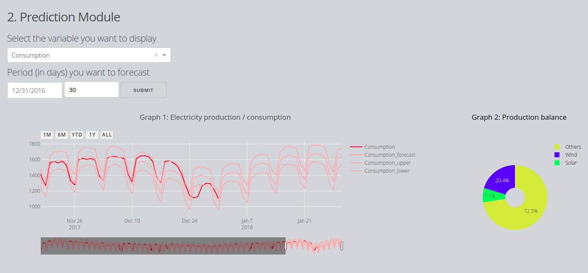

### OPSD dashboard
**Purpose**: Create a web application displaying German electricity production balance total consumption with viewer and forecast features.

## Data details
Wind, Solar and Consumption in Germany from 2006-01-01 until 20017-12-31 (source: https://open-power-system-data.org/)

## Architecture
* graphs_layout.py: generic and specific layouts for graph
* html_components.py: build function for html bricks: banner, menu, graphs
* data_process.py: loading data functions from database
* server.py: core of the dash app: css links, app layout, callbacks
* main.py: running file

## Features and graphs
* Visualization module: timeframe selection

* Prediction module: starting date and forecasting period inputs - predictions done with a prophet model (https://facebook.github.io/prophet/)

  - Prediction viewer for electricity consumption forecast of 30 days

  - Prediction viewer for wind production forecast of 90 days

  - Prediction viewer for solar production forecast of 180 days

